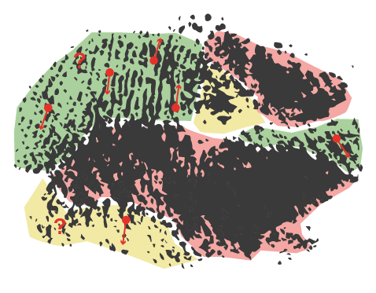

# OpenAFQA

The repository for developing Automated Fingermark Quality Assessment methods.

## Contents
    
- **[AFQA Toolbox.](afqa_toolbox)** The continuously developed Automated Fingermark Quality Assessment toolbox consists of a collection of commonly used algorithms for friction ridge preprocessing and feature extraction.
- **[Toolbox examples.](toolbox_examples)** Practical examples, where the usage of the toolbox is demonstrated.
- **[Experiments.](experiments)** Code for various publications, related to automated fingermark quality assessment. 
- **[Quality measures.](quality)** Python implementations or wrappers of ours and related fingerprint/fingermark quality assessment methhods.

### Toolbox Installation

1. Set up a Python environment by installing packages in requirements.txt
2. To use the minutiae extraction wrappers, download and compile the code. For more imformation on this, see [minutiae extraction README](afqa_toolbox/minutiae/README.md). 
3. The toolbox can be installed locally by running `python setup.py install` or `python setup.py develop` if you want to modify its contents. 
 
### References
If you use our open-source software, please cite: 
    
    T. Oblak, R. Haraksim, L. Beslay, P. Peer. 
    Fingermark Quality Assessment: An Open-Source Toolbox. 
    In proceedings of the International Conference of the Biometrics Special Interest Group (BIOSIG), pp. 159-170, 2021.
    
    

